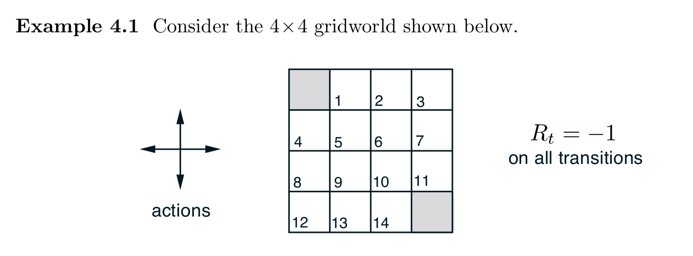

# Tensorial-Solution-of-Iterative-Policy-Evaluation-

For Reinforcement Learning, here is proposed a tensorial solution of "Iterative Policy Evaluation" algorithm. Applied to a gridworld environment problem, shown in Example 4.1, Chapter 4 Dynamic Programming of "Reinforcement Learning, An Introduction" book.

