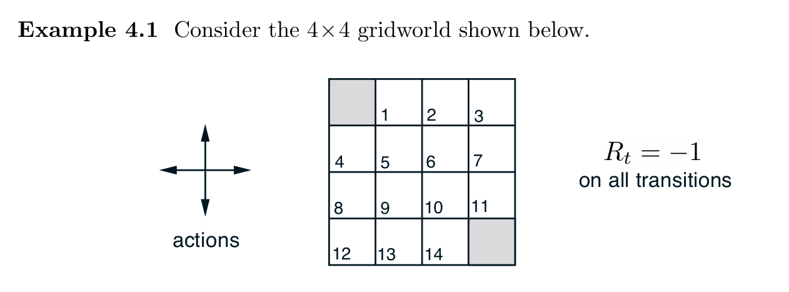
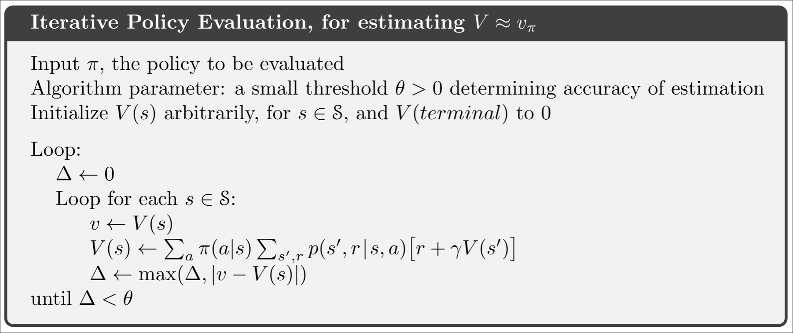

# Tensorial Solution of the Iterative Policy Evaluation Algorithm

For Reinforcement Learning, more specifically for Dynamic Programming, here I propose a tensorial solution of the "Iterative Policy Evaluation" algorithm, an important part to solve Markov Decision Processes. 

$$
\begin{equation}\tag{1}
    V_{k+1}=(R+V_k^T)\otimes P\Pi 
\end{equation}
$$

Repository shows the implementation of the new proposal and it is applied to a gridworld environment problem (shown in Example 4.1, Chapter 4 Dynamic Programming of "Reinforcement Learning, An Introduction" book) showing it usability.

{width=600}

## Iterative Policy Evaluation

Original inspiration is taken by Chapter 4 Dynamic Programming of "Reinforcement Learning, An Introduction" book, there the autor gives a way to compute the "Iterative Policy Evaluation" algorithm, an approximation that comes from the Bellman equation using it as an update rule. 

Algorithm as proposed in the book is as follows:

$$
\begin{equation}\tag{2}
    V_{k+1}(s)=\sum_a\pi(a|s)\sum_{s',r}p(s',r|s,a)[r+\gamma v_k(s')]
\end{equation}
$$

{width=600}

## Tensorial Iterative Policy Evaluation

Solution proposed arrives with the "Iterative Policy Evaluation" as a tensorial function, changing functions inside into tensors with diferent dimensions. 

$$
\begin{equation}\tag{7}
    V_{k+1}=(R+V_k^T)\otimes P\Pi 
\end{equation}
$$

This function provides the possibility of computing all states in once. So instead of iterating between sums as in the orinal way, it allows to make the product of all the elements in one step, doing it simplier.  An import detail is that $p(s',r|s,a)$ is seen as a combination of the transition matrices that build the gridworld possible transitions between states.

The construction of the tensors is as follows:
$n$ satisfies the number of states, $m$ the number of possible actions and $\gamma$ a parameter called the discount rate.

### State value vector for $v_k(s')$
$$
\begin{equation}\tag{3}
    V_{k}=
    \begin{pmatrix}
        V_k(1) \\
        \vdots \\
        V_k(n)
    \end{pmatrix}
\end{equation}
$$

### Reward vector for $r$
$$
\begin{equation}\tag{4}
    R=
    \begin{pmatrix}
        r_1 & \cdots & r_n
    \end{pmatrix}
\end{equation}
$$

### Actions probabilities vector for $\pi(a|s)$
$$
\begin{equation}\tag{5}
    \Pi=
    \begin{pmatrix}
        \pi_1 \\
        \vdots \\
        \pi_m
    \end{pmatrix}
\end{equation}
$$

### Transition matrices tensor for $p(s',r|s,a)$
$$
\begin{equation}\tag{6}
    P=
    \begin{pmatrix}
        P_1 \\
        \vdots \\
        P_m
    \end{pmatrix} \text{where }
    P_i=
    \begin{pmatrix}
        p_{11} & \cdots & p_{1n}\\
        \vdots & & \vdots \\
        p_{n1} & \cdots & p_{nn}
    \end{pmatrix}
\end{equation}
$$

Motivation went when trying to implement book's algorithm, thinking it was quite laborious, and believing somethere was a simpler way; aplying matrices instead of sums, avoiding to compute it with "for loops", just with "numpy" operations. At the time, thinking of how to convert it in a tensorial function was way more difficult, but the result simplified a lot.